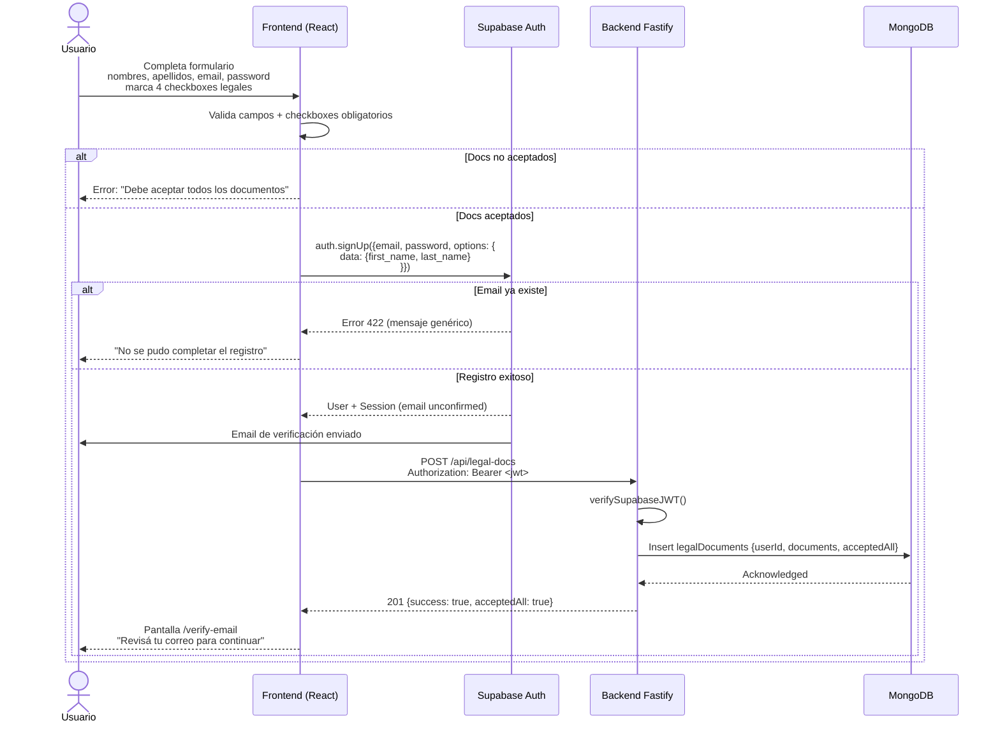
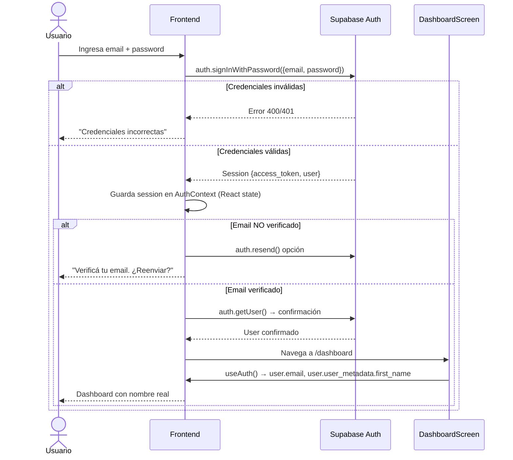
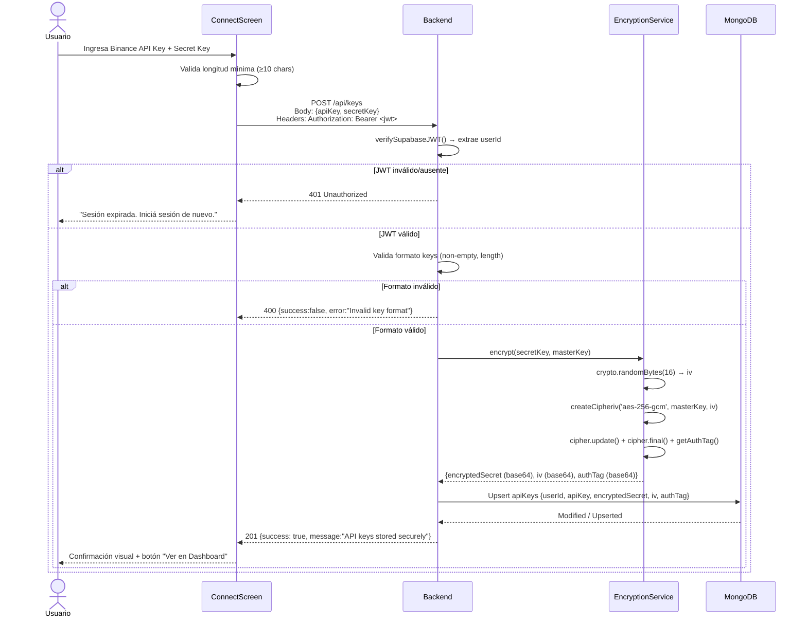
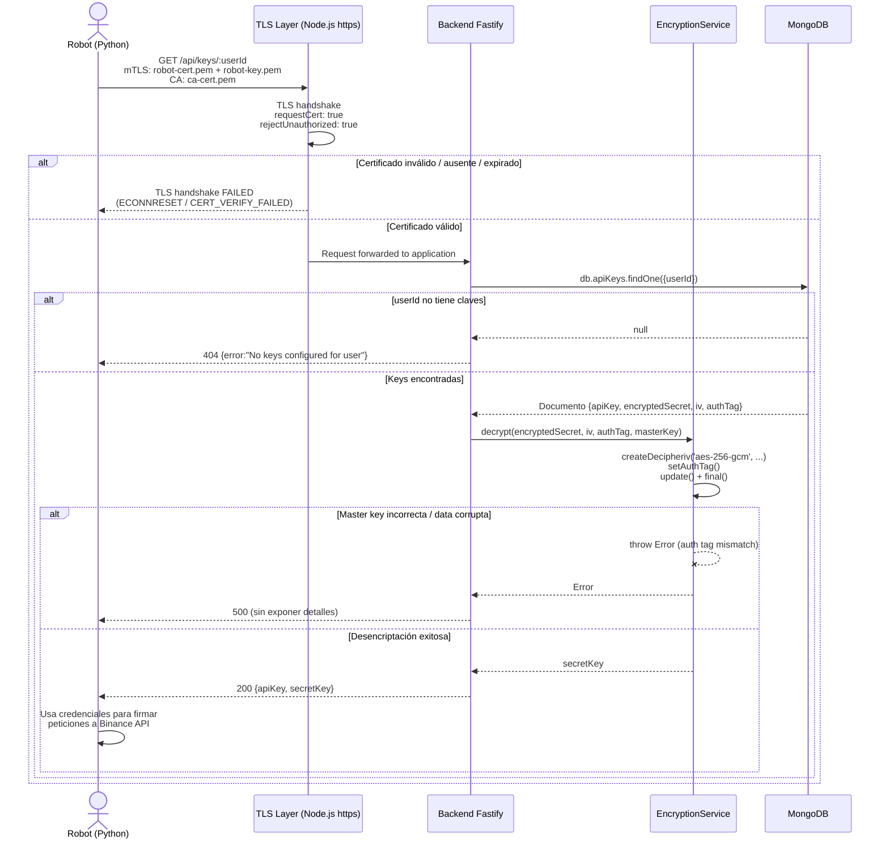

# SDD Design: Sistema de Autenticación y Gestión de Claves API

## Status
Design — Approved

## 1. Project Structure

```
cryptoinvestor/
├── openspec/                          # SDD artifacts (existing)
│   └── sdd-auth-system/
│       ├── proposal.md
│       ├── spec.md
│       └── design.md                  # this file
├── src/                               # Frontend (React + Vite)
│   ├── lib/
│   │   └── supabase.ts                # Supabase client singleton
│   ├── contexts/
│   │   └── AuthContext.tsx            # NEW: Supabase auth state provider
│   ├── components/
│   │   └── ProtectedRoute.tsx         # NEW: Route guard wrapper
│   ├── screens/
│   │   ├── LoginScreen.tsx            # NEW
│   │   ├── RegisterScreen.tsx         # NEW
│   │   ├── VerifyEmailScreen.tsx      # NEW
│   │   ├── OnboardingScreen.tsx       # MODIFY: add login/register entry
│   │   ├── ConnectScreen.tsx          # MODIFY: send keys to backend API
│   │   └── DashboardScreen.tsx        # MODIFY: display real user name + logout
│   ├── components/layout/
│   │   ├── TopBar.tsx                 # MODIFY: add logout button
│   │   └── Sidebar.tsx                # MODIFY: show user info
│   ├── hooks/
│   │   └── useTrading.tsx             # MODIFY: integrate with AuthContext
│   ├── types/
│   │   └── index.ts                   # MODIFY: add auth types
│   ├── App.tsx                        # MODIFY: new routes + AuthProvider wrapper
│   └── main.tsx                       # no change
├── backend/                           # NEW: Fastify + TypeScript + MongoDB
│   ├── src/
│   │   ├── config/
│   │   │   ├── env.ts                 # Env validation (zod)
│   │   │   ├── database.ts            # MongoDB connection
│   │   │   └── supabase.ts            # Supabase admin client (for JWT verify)
│   │   ├── plugins/
│   │   │   ├── cors.ts                # CORS for frontend origin
│   │   │   ├── auth.ts                # Supabase JWT verification hook
│   │   │   └── mtls.ts                # mTLS server setup
│   │   ├── routes/
│   │   │   ├── keys.ts                # POST /api/keys (user-facing, JWT auth)
│   │   │   ├── legalDocs.ts           # POST/GET /api/legal-docs (JWT auth)
│   │   │   ├── robotKeys.ts           # GET /api/keys/:userId (mTLS only)
│   │   │   └── health.ts              # GET /health
│   │   ├── services/
│   │   │   ├── encryption.ts          # AES-256-GCM encrypt/decrypt
│   │   │   ├── keysService.ts         # Business logic for API keys
│   │   │   └── legalDocsService.ts    # Business logic for legal docs
│   │   ├── types/
│   │   │   └── index.ts               # Shared backend types
│   │   ├── utils/
│   │   │   └── errors.ts              # Standard error classes + formatter
│   │   └── index.ts                   # Server bootstrap (dual ports)
│   ├── certs/                         # .gitignored; runtime certificates
│   ├── scripts/
│   │   └── generate-certs.sh          # OpenSSL CA + server + robot certs
│   ├── .env.example
│   ├── package.json
│   └── tsconfig.json
├── package.json                       # Frontend deps + root scripts
├── tsconfig.json                      # Frontend
└── vite.config.ts                     # Frontend
```

**Rationale:** Monorepo flat. Frontend stays at root because Vite expects `index.html` there. Backend is a self-contained `backend/` folder with its own `package.json` and `tsconfig.json`. This allows independent deploy while keeping everything in one repo.

---

## 2. Component Diagram

```
┌─────────────────────────────────────────────────────────────────────────────┐
│                               FRONTEND (Browser)                            │
│  ┌──────────────┐  ┌──────────────┐  ┌─────────────────────────────────────┐ │
│  │ LoginScreen  │  │RegisterScreen│  │         AuthContext               │ │
│  └──────┬───────┘  └──────┬───────┘  │  ┌─────────────────────────────┐   │ │
│         │                 │          │  │ Supabase Auth               │   │ │
│         └────────┬────────┘          │  │  ├─ Session (memory only)    │   │ │
│                  │                   │  │  ├─ User (email, metadata)  │   │ │
│                  ▼                   │  │  └─ onAuthStateChange       │   │ │
│            ┌──────────┐              │  └─────────────────────────────┘   │ │
│            │Supabase  │              │                  │                 │ │
│            │  Client │◄─────────────┘                  │                 │ │
│            └────┬────┘                                 │                 │ │
│                 │                                       │                 │ │
│                 │ HTTPS                                   │                 │ │
└─────────────────┼───────────────────────────────────────┼─────────────────┘
                  │                                       │
                  ▼                                       │
┌───────────────────────────────────────────────────────┼─────────────────────┐
│                         BACKEND (Node.js + Fastify)   │                     │
│  ┌──────────────────────────────────────────────────┼─────────────────┐ │
│  │  PUBLIC SERVER (PORT 3000) — CORS + JWT           │                 │ │
│  │  ┌─────────────┐  ┌─────────────┐  ┌───────────┴──────────┐      │ │
│  │  │ CORS Plugin │→ │ Auth Plugin │→ │  Route Handlers      │      │ │
│  │  └─────────────┘  └──────┬──────┘  │  POST /api/keys      │      │ │
│  │                          │         │  POST/GET /legal-docs│      │ │
│  │                          │         └──────────────────────┘      │ │
│  │                          │                                        │ │
│  │                   Supabase JWT Verify                              │ │
│  │                   (verify with jwt-secret)                         │ │
│  └──────────────────────────────────────────────────────────────────┘ │
│                                                                       │
│  ┌──────────────────────────────────────────────────────────────────┐ │
│  │  ROBOT SERVER (PORT 3001) — mTLS ONLY                           │ │
│  │  ┌─────────────────┐  ┌──────────────────────────────────────┐  │ │
│  │  │ mTLS (Node TLS) │→ │ GET /api/keys/:userId               │  │ │
│  │  │  requestCert    │  │  ├─ Find MongoDB record             │  │ │
│  │  │  rejectUnauthorized│  ├─ AES-256-GCM decrypt              │  │ │
│  │  └─────────────────┘  │  └─ Return {apiKey, secretKey}      │  │ │
│  │                       └──────────────────────────────────────┘  │ │
│  └──────────────────────────────────────────────────────────────────┘ │
│                                                                       │
│  ┌─────────────────┐  ┌─────────────────┐  ┌─────────────────────┐   │
│  │ Encryption Svc  │  │ Keys Service    │  │ LegalDocs Service   │   │
│  │ (crypto module) │  │ (MongoDB ops)   │  │ (MongoDB ops)       │   │
│  └─────────────────┘  └─────────────────┘  └─────────────────────┘   │
│                                                                       │
│  ┌──────────────────────────────────────────────────────────────┐    │
│  │                    MongoDB (localhost / Atlas)                 │    │
│  │  ┌──────────────┐  ┌──────────────────┐  ┌───────────────┐  │    │
│  │  │ collection:  │  │ collection:        │  │ collection:   │  │    │
│  │  │ apiKeys      │  │ legalDocuments     │  │ (optional)    │  │    │
│  │  └──────────────┘  └──────────────────┘  └───────────────┘  │    │
│  └──────────────────────────────────────────────────────────────┘    │
└───────────────────────────────────────────────────────────────────────┘
                  │
                  │ mTLS + AES-decrypted keys
                  ▼
┌───────────────────────────────────────────────────────────────────────┐
│                         ROBOT (Python)                                │
│  ┌─────────────────────────────────────────────────────────────────┐  │
│  │  Trading Engine                                                  │  │
│  │   ├─ Poll GET https://backend:3001/api/keys/:userId             │  │
│  │   │   with client cert (robot-cert.pem + robot-key.pem)         │  │
│  │   ├─ Receive {apiKey, secretKey}                                │  │
│  │   └─ Call Binance API (signed with HMAC-SHA256)                  │  │
│  └─────────────────────────────────────────────────────────────────┘  │
└───────────────────────────────────────────────────────────────────────┘
```

---

## 3. Sequence Diagrams

### 3.1 User Registration Flow



### 3.2 User Login Flow



### 3.3 Store API Keys Flow



### 3.4 Robot Fetches Keys Flow (mTLS)



---

## 4. State Management

### 4.1 AuthProvider Architecture

```typescript
// src/contexts/AuthContext.tsx

interface AuthState {
  user: User | null;           // Supabase User object
  session: Session | null;     // Supabase Session (contains access_token)
  loading: boolean;            // Initial auth check on mount
  error: string | null;        // Last auth error message
}

const AuthContext = createContext<{
  state: AuthState;
  login: (email: string, password: string) => Promise<void>;
  register: (data: RegisterData) => Promise<void>;
  logout: () => Promise<void>;
  resendVerification: () => Promise<void>;
} | null>(null);
```

### 4.2 JWT Flow

```
┌─────────────┐     ┌─────────────────┐     ┌──────────────────┐
│  Supabase   │────▶│  AuthContext    │────▶│  API Client      │
│  Auth       │     │  (React memory) │     │  (axios/fetch)   │
│  (Cloud)    │     │                 │     │                  │
└─────────────┘     └─────────────────┘     └────────┬─────────┘
                                                      │
                                     Authorization: Bearer <access_token>
                                                      │
                                                      ▼
                                              ┌───────────────┐
                                              │ Backend       │
                                              │ Auth Plugin   │
                                              │ - Extract JWT │
                                              │ - Verify sig  │
                                              │ - Attach user │
                                              └───────────────┘
```

**Critical Decision: NO localStorage for JWT**
- The access_token is stored ONLY in React state (`useState` inside AuthContext).
- On page refresh, the token is lost. Recovery: `supabase.auth.getSession()` queries Supabase (which stores the refresh token in a secure httpOnly cookie on Supabase's domain).
- This prevents XSS token theft while preserving session across refreshes via Supabase's secure cookie mechanism.
- TradingProvider now consumes `useAuth()` to get the real `user.id` instead of using `mockUser`.

### 4.3 Provider Nesting

```tsx
// main.tsx or App.tsx
<SupabaseProvider>          {/* @supabase/supabase-js client singleton */}
  <AuthProvider>            {/* Manages auth state + session recovery */}
    <TradingProvider>       {/* Business logic: trades, account, keys status */}
      <BrowserRouter>
        <App />
      </BrowserRouter>
    </TradingProvider>
  </AuthProvider>
</SupabaseProvider>
```

`TradingProvider` fetches trade/account data from backend using the JWT obtained from `AuthProvider`.

---

## 5. Database Schema Design

### 5.1 MongoDB Collections

#### `apiKeys`

```typescript
interface ApiKeyDocument {
  _id: ObjectId;
  userId: string;              // Supabase UUID (36 chars)
  apiKey: string;              // Binance API Key (plain text)
  encryptedSecret: string;      // base64 ciphertext
  iv: string;                  // base64, 16 bytes → 24 chars base64
  authTag: string;             // base64, 16 bytes → 24 chars base64
  createdAt: Date;
  updatedAt: Date;
}
```

**Indexes:**
```javascript
db.apiKeys.createIndex({ userId: 1 }, { unique: true });
db.apiKeys.createIndex({ createdAt: -1 });
```

#### `legalDocuments`

```typescript
interface LegalDocumentRecord {
  _id: ObjectId;
  userId: string;              // Supabase UUID
  documents: Array<{
    docId: 'tos' | 'risk' | 'api' | 'custody';
    title: string;
    acceptedAt: Date;
  }>;
  acceptedAll: boolean;
  createdAt: Date;
  updatedAt: Date;
}
```

**Indexes:**
```javascript
db.legalDocuments.createIndex({ userId: 1 }, { unique: true });
db.legalDocuments.createIndex({ acceptedAll: 1 });
```

#### `userProfiles` (MongoDB cache — optional, lightweight)

```typescript
interface UserProfileCache {
  _id: ObjectId;
  userId: string;              // Supabase UUID
  firstName: string;
  lastName: string;
  lastSyncedAt: Date;          // For potential sync from Supabase
}
```

**Rationale:** A minimal cache in MongoDB allows backend services to resolve user names without hitting Supabase PostgreSQL. Sync on registration.

### 5.2 Supabase PostgreSQL Schema Extension

**Table: `public.profiles`** (managed via Supabase Dashboard / migrations)

```sql
CREATE TABLE public.profiles (
  id UUID REFERENCES auth.users(id) ON DELETE CASCADE PRIMARY KEY,
  first_name TEXT NOT NULL,
  last_name TEXT NOT NULL,
  created_at TIMESTAMPTZ DEFAULT NOW(),
  updated_at TIMESTAMPTZ DEFAULT NOW()
);

-- Row Level Security
ALTER TABLE public.profiles ENABLE ROW LEVEL SECURITY;

CREATE POLICY "Users can read own profile"
  ON public.profiles FOR SELECT
  USING (auth.uid() = id);

CREATE POLICY "Users can update own profile"
  ON public.profiles FOR UPDATE
  USING (auth.uid() = id);
```

**Trigger:** Auto-create profile on user signup via Supabase Function or Database Trigger:

```sql
CREATE OR REPLACE FUNCTION public.handle_new_user()
RETURNS TRIGGER AS $$
BEGIN
  INSERT INTO public.profiles (id, first_name, last_name)
  VALUES (
    NEW.id,
    NEW.raw_user_meta_data->>'first_name',
    NEW.raw_user_meta_data->>'last_name'
  );
  RETURN NEW;
END;
$$ LANGUAGE plpgsql SECURITY DEFINER;

CREATE TRIGGER on_auth_user_created
  AFTER INSERT ON auth.users
  FOR EACH ROW
  EXECUTE FUNCTION public.handle_new_user();
```

---

## 6. API Design Decisions

### 6.1 Plugin Architecture (Fastify)

Fastify's plugin system enforces encapsulation. We use three plugin scopes:

```
App (index.ts)
├── PublicPlugin (port 3000)
│   ├── CORS Plugin
│   ├── Auth Plugin (JWT verification hook)
│   ├── Health Routes
│   ├── Keys Routes (/api/keys)
│   └── LegalDocs Routes (/api/legal-docs)
└── RobotPlugin (port 3001)
    ├── mTLS Plugin (https.createServer options)
    └── RobotKeys Routes (/api/keys/:userId)
```

**Why two servers?** Separation of concerns:
- Public server: needs CORS, no mTLS, serves user-facing API.
- Robot server: needs mTLS, no CORS (robot connects from backend infra), serves machine-facing API.
- If one surface is compromised, the other remains isolated.

### 6.2 Middleware Pipeline

```typescript
// Public server pipeline
fastify.addHook('onRequest', async (request, reply) => {
  // 1. CORS handled by @fastify/cors
  // 2. Auth handled by route-level preValidation hook
});

// Auth hook (applied selectively to protected routes)
const verifySupabaseJWT = async (request: FastifyRequest, reply: FastifyReply) => {
  const authHeader = request.headers.authorization;
  if (!authHeader?.startsWith('Bearer ')) {
    throw new UnauthorizedError('Missing authorization header');
  }
  const token = authHeader.slice(7);
  const { data: { user }, error } = await supabaseAdmin.auth.getUser(token);
  if (error || !user) {
    throw new UnauthorizedError('Invalid or expired token');
  }
  request.user = { userId: user.id, email: user.email };
};

// Usage in route file
fastify.addHook('preValidation', verifySupabaseJWT);
```

**Why `getUser()` instead of local JWT verification?**
- `getUser()` calls Supabase Auth server to validate the token in real-time.
- This handles token revocation (if user logs out or is banned) immediately without waiting for JWT expiry.
- Trade-off: +1 network hop per request. For high-throughput scenarios, switch to local JWT verification with `jsonwebtoken` library. Acceptable for MVP.

### 6.3 Route Organization

```typescript
// src/routes/keys.ts
export default async function keysRoutes(fastify: FastifyInstance) {
  fastify.addHook('preValidation', verifySupabaseJWT);

  fastify.post('/', async (request, reply) => {
    const userId = request.user!.userId;
    const { apiKey, secretKey } = request.body as StoreKeysBody;
    // validate, encrypt, store...
  });
}

// src/routes/robotKeys.ts
export default async function robotKeysRoutes(fastify: FastifyInstance) {
  // NO auth hook — identity is the mTLS certificate
  fastify.get('/:userId', async (request, reply) => {
    const { userId } = request.params as { userId: string };
    // lookup, decrypt, return...
  });
}
```

---

## 7. Security Implementation Details

### 7.1 AES-256-GCM Encryption Service

```typescript
// src/services/encryption.ts
import { createCipheriv, createDecipheriv, randomBytes, scryptSync } from 'crypto';

const ALGORITHM = 'aes-256-gcm';
const IV_LENGTH = 16;
const AUTH_TAG_LENGTH = 16;

// Master key loaded from env, must be 32 bytes or derived to 32 bytes
const masterKey = deriveKey(process.env.MASTER_KEY!);

function deriveKey(input: string): Buffer {
  // If input is base64 of 32 random bytes, decode it.
  // Otherwise, use scrypt to stretch it to 32 bytes.
  try {
    const decoded = Buffer.from(input, 'base64');
    if (decoded.length === 32) return decoded;
  } catch { /* fall through */ }
  return scryptSync(input, 'cryptoinvestor-salt', 32);
}

export interface EncryptedData {
  encryptedSecret: string; // base64
  iv: string;                // base64
  authTag: string;           // base64
}

export function encrypt(plainText: string): EncryptedData {
  const iv = randomBytes(IV_LENGTH);
  const cipher = createCipheriv(ALGORITHM, masterKey, iv);
  
  let encrypted = cipher.update(plainText, 'utf8', 'base64');
  encrypted += cipher.final('base64');
  
  const authTag = cipher.getAuthTag();
  
  return {
    encryptedSecret: encrypted,
    iv: iv.toString('base64'),
    authTag: authTag.toString('base64'),
  };
}

export function decrypt(data: EncryptedData): string {
  const iv = Buffer.from(data.iv, 'base64');
  const authTag = Buffer.from(data.authTag, 'base64');
  
  const decipher = createDecipheriv(ALGORITHM, masterKey, iv);
  decipher.setAuthTag(authTag);
  
  let decrypted = decipher.update(data.encryptedSecret, 'base64', 'utf8');
  decrypted += decipher.final('utf8');
  
  return decrypted;
}
```

**Key points:**
- `scryptSync` fallback ensures any string input can become a 32-byte key, but **production should use a 32-byte base64 secret**.
- `aes-256-gcm` provides both confidentiality and integrity (auth tag prevents tampering).
- The `authTag` must be stored alongside ciphertext; without it, decryption fails.

### 7.2 mTLS Server Configuration

```typescript
// src/plugins/mtls.ts
import { readFileSync } from 'fs';
import { join } from 'path';
import Fastify from 'fastify';

export function createRobotServer() {
  const keyPath = process.env.SERVER_KEY_PATH!;
  const certPath = process.env.SERVER_CERT_PATH!;
  const caPath = process.env.CA_CERT_PATH!;

  return Fastify({
    logger: true,
    https: {
      key: readFileSync(join(process.cwd(), keyPath)),
      cert: readFileSync(join(process.cwd(), certPath)),
      ca: readFileSync(join(process.cwd(), caPath)),
      requestCert: true,
      rejectUnauthorized: true,
    },
  });
}
```

**Security notes:**
- `requestCert: true` → Server requests client certificate.
- `rejectUnauthorized: true` → If client doesn't present a valid cert signed by the CA, TLS handshake aborts before any application code runs.
- The robot endpoint is unreachable from browsers or curl without the robot certificate.
- For defense in depth, we also check `request.raw.socket.getPeerCertificate()` in the route handler to log the client CN.

### 7.3 Certificate Generation Script

```bash
#!/bin/bash
# backend/scripts/generate-certs.sh

set -e
CERT_DIR="../certs"
mkdir -p "$CERT_DIR"

echo "=== Generating CA ==="
openssl req -x509 -newkey rsa:4096 -sha256 -days 3650 -nodes \
  -keyout "$CERT_DIR/ca-key.pem" \
  -out "$CERT_DIR/ca-cert.pem" \
  -subj "/CN=CryptoInvestor-Internal-CA"

echo "=== Generating Server Certificate ==="
openssl req -newkey rsa:4096 -nodes \
  -keyout "$CERT_DIR/server-key.pem" \
  -out "$CERT_DIR/server-req.pem" \
  -subj "/CN=api.cryptoinvestor.local"

openssl x509 -req -sha256 -days 365 \
  -in "$CERT_DIR/server-req.pem" \
  -CA "$CERT_DIR/ca-cert.pem" \
  -CAkey "$CERT_DIR/ca-key.pem" \
  -CAcreateserial \
  -out "$CERT_DIR/server-cert.pem" \
  -extensions v3_req -extfile <(printf "[v3_req]\nsubjectAltName=DNS:api.cryptoinvestor.local,DNS:localhost,IP:127.0.0.1")

echo "=== Generating Robot Client Certificate ==="
openssl req -newkey rsa:4096 -nodes \
  -keyout "$CERT_DIR/robot-key.pem" \
  -out "$CERT_DIR/robot-req.pem" \
  -subj "/CN=trading-robot"

openssl x509 -req -sha256 -days 365 \
  -in "$CERT_DIR/robot-req.pem" \
  -CA "$CERT_DIR/ca-cert.pem" \
  -CAkey "$CERT_DIR/ca-key.pem" \
  -CAcreateserial \
  -out "$CERT_DIR/robot-cert.pem"

echo "=== Cleanup ==="
rm -f "$CERT_DIR/server-req.pem" "$CERT_DIR/robot-req.pem" "$CERT_DIR/ca-cert.srl"

echo "Done. Certificates in $CERT_DIR/"
```

---

## 8. Error Handling Strategy

### 8.1 Standard Error Response Format

All API errors return this shape:

```json
{
  "success": false,
  "error": "Human-readable message",
  "code": "MACHINE_READABLE_CODE"
}
```

### 8.2 Error Classes

```typescript
// src/utils/errors.ts
export class ApiError extends Error {
  constructor(
    message: string,
    public statusCode: number,
    public code: string
  ) {
    super(message);
  }
}

export class UnauthorizedError extends ApiError {
  constructor(message = 'Unauthorized') {
    super(message, 401, 'UNAUTHORIZED');
  }
}

export class ValidationError extends ApiError {
  constructor(message: string) {
    super(message, 400, 'VALIDATION_ERROR');
  }
}

export class NotFoundError extends ApiError {
  constructor(resource: string) {
    super(`${resource} not found`, 404, 'NOT_FOUND');
  }
}

export class ConflictError extends ApiError {
  constructor(message: string) {
    super(message, 409, 'CONFLICT');
  }
}
```

### 8.3 Global Error Handler

```typescript
// In index.ts
fastify.setErrorHandler((error, request, reply) => {
  if (error instanceof ApiError) {
    reply.status(error.statusCode).send({
      success: false,
      error: error.message,
      code: error.code,
    });
    return;
  }

  // Log unexpected errors (but never log secrets)
  fastify.log.error({ err: error, reqId: request.id }, 'Unexpected error');

  reply.status(500).send({
    success: false,
    error: process.env.NODE_ENV === 'development' ? error.message : 'Internal server error',
    code: 'INTERNAL_ERROR',
  });
});
```

### 8.4 Logging Strategy

- Use Fastify's built-in **pino** logger.
- Log level: `info` for production, `debug` for development.
- **NEVER log:** `secretKey`, `masterKey`, `password`, JWT tokens, private key contents.
- **DO log:** request method/path, userId (from JWT), response status, duration.
- MongoDB operations logged at `debug` level with query shape (not values).

```typescript
// Safe logging example
fastify.log.info({ userId: request.user?.userId }, 'API keys stored');
// NOT: fastify.log.info({ secretKey }, 'Received keys');
```

---

## 9. Decisions Log

### Decision 1: Where to store first_name / last_name?

**Decision:** Supabase `public.profiles` (PostgreSQL), with auto-trigger on auth.users insert.

**Justification:**
- Auth identity data belongs with the auth provider. Keeping names in Supabase maintains a single source of truth for user identity.
- Supabase Row Level Security (RLS) policies can protect profiles naturally.
- The `auth.users` trigger auto-creates the profile row, so the frontend only needs one call (`signUp`).
- MongoDB gets a minimal `userProfiles` cache only if backend services need names without querying Supabase.
- If we later migrate away from Supabase, we can export profiles to MongoDB.

**Rejected alternative:** MongoDB `userProfiles` as primary. Reason: splits identity across two databases, complicates registration flow, no RLS.

### Decision 2: Backend in same repo or separate?

**Decision:** `backend/` subfolder in the same repo (monorepo).

**Justification:**
- Single `git clone` gets everything needed for local development.
- Shared TypeScript types/interfaces can be symlinked or published as a local package in the future.
- Frontend and backend can be reviewed together when changes touch both (e.g., API contract changes).
- The user explicitly prefers same repo.
- If backend scales to multiple services or teams, extraction to a separate repo is trivial later.

**Rejected alternative:** Separate repo. Reason: adds git overhead, complicates local setup, no current team/CI need.

### Decision 3: JWT verification via Supabase getUser() vs local verification?

**Decision:** `supabase.auth.getUser(token)` (server-side verification via Supabase).

**Justification:**
- Handles token revocation immediately (logout, ban, password change).
- No need to manage JWT secret rotation locally.
- Acceptable latency for a trading dashboard (not a high-frequency API).

**Trade-off:** +1 network round-trip per request. If latency becomes an issue, migrate to local `jsonwebtoken` verification with a cached JWKS.

### Decision 4: Two Fastify instances vs one instance with route-level mTLS?

**Decision:** Two separate Fastify instances on different ports.

**Justification:**
- Node.js TLS options apply at the server level, not route level. You cannot have `requestCert: true` for one route and `false` for another on the same HTTPS server without complex SNI or proxy layers.
- Physical separation prevents accidental exposure of robot endpoints to the public port.
- Different ports allow different firewall rules (e.g., robot port only accessible from internal VPC).

---

## 10. Implementation Order

### PR 1: Frontend Auth Foundation (~250 lines)
**Goal:** Users can register, verify email, login, logout. Protected routes active.

1. `npm install @supabase/supabase-js`
2. `src/lib/supabase.ts` — client singleton
3. `src/contexts/AuthContext.tsx` — state management + auth methods
4. `src/components/ProtectedRoute.tsx` — redirect unauthenticated users
5. `src/screens/LoginScreen.tsx`
6. `src/screens/RegisterScreen.tsx` (with 4 legal doc checkboxes)
7. `src/screens/VerifyEmailScreen.tsx`
8. `src/App.tsx` — wrap with AuthProvider, add new routes
9. `src/screens/OnboardingScreen.tsx` — add entry points to login/register
10. `src/components/layout/TopBar.tsx` — add logout button
11. `src/hooks/useTrading.tsx` — replace `mockUser` with `useAuth()` user

### PR 2: Backend Core API (~350 lines)
**Goal:** Fastify server runs. Users can store API keys and accept legal docs.

1. `mkdir backend && cd backend && npm init -y`
2. `backend/package.json` — dependencies
3. `backend/tsconfig.json`
4. `backend/.env.example`
5. `backend/src/config/env.ts` — zod env validation
6. `backend/src/config/database.ts` — MongoDB client connection
7. `backend/src/config/supabase.ts` — admin client for JWT verification
8. `backend/src/utils/errors.ts` — error classes
9. `backend/src/plugins/cors.ts`
10. `backend/src/plugins/auth.ts` — Supabase JWT verification hook
11. `backend/src/services/encryption.ts` — AES-256-GCM
12. `backend/src/services/keysService.ts` — MongoDB operations for apiKeys
13. `backend/src/services/legalDocsService.ts` — MongoDB operations for legalDocs
14. `backend/src/routes/keys.ts` — POST /api/keys
15. `backend/src/routes/legalDocs.ts` — POST/GET /api/legal-docs
16. `backend/src/routes/health.ts` — health check
17. `backend/src/index.ts` — public server bootstrap (port 3000)

### PR 3: mTLS + Robot Endpoint (~200 lines)
**Goal:** Robot can fetch decrypted keys via mTLS.

1. `backend/scripts/generate-certs.sh`
2. Run script → produce `backend/certs/*.pem`
3. `backend/src/plugins/mtls.ts` — robot server factory
4. `backend/src/routes/robotKeys.ts` — GET /api/keys/:userId
5. `backend/src/index.ts` — start BOTH public and robot servers
6. `backend/.env.example` — add cert paths + ROBOT_PORT
7. Test script (curl or Python) to verify mTLS handshake

---

## 11. Files to Create / Modify

### New Files (Frontend)

| File | Purpose | Lines (est) |
|------|---------|-------------|
| `src/lib/supabase.ts` | Supabase client singleton with env vars | 15 |
| `src/contexts/AuthContext.tsx` | Auth state, login, register, logout, session recovery | 120 |
| `src/components/ProtectedRoute.tsx` | Route guard: redirects to /login if unauthenticated | 25 |
| `src/screens/LoginScreen.tsx` | Email/password form + error handling | 80 |
| `src/screens/RegisterScreen.tsx` | Registration form + 4 legal doc checkboxes | 120 |
| `src/screens/VerifyEmailScreen.tsx` | Post-registration screen, resend option | 40 |

### Modified Files (Frontend)

| File | Purpose | Lines (est) |
|------|---------|-------------|
| `src/App.tsx` | Add routes (/login, /register, /verify-email), wrap with AuthProvider | 40 |
| `src/screens/OnboardingScreen.tsx` | Add "Iniciar sesión" / "Crear cuenta" buttons | 20 |
| `src/screens/ConnectScreen.tsx` | Send Binance keys to backend POST /api/keys instead of local state | 30 |
| `src/screens/DashboardScreen.tsx` | Display real user name from auth context | 15 |
| `src/components/layout/TopBar.tsx` | Add logout button + user avatar/name | 25 |
| `src/hooks/useTrading.tsx` | Remove mockUser, consume AuthContext user.id | 20 |
| `src/types/index.ts` | Add auth-related types | 15 |
| `package.json` | Add `@supabase/supabase-js` dependency | 2 |
| `.env.example` (root) | Add VITE_SUPABASE_URL, VITE_SUPABASE_ANON_KEY | 5 |

### New Files (Backend)

| File | Purpose | Lines (est) |
|------|---------|-------------|
| `backend/package.json` | Fastify, MongoDB, TypeScript deps | 35 |
| `backend/tsconfig.json` | Node + strict TypeScript config | 25 |
| `backend/.env.example` | All required env vars documented | 25 |
| `backend/src/config/env.ts` | Zod validation for all env vars | 40 |
| `backend/src/config/database.ts` | MongoDB client + connection management | 30 |
| `backend/src/config/supabase.ts` | Supabase admin client creation | 15 |
| `backend/src/utils/errors.ts` | ApiError hierarchy + Fastify error handler | 45 |
| `backend/src/plugins/cors.ts` | CORS config for frontend origin | 15 |
| `backend/src/plugins/auth.ts` | JWT extraction + Supabase verification | 35 |
| `backend/src/plugins/mtls.ts` | Robot HTTPS server factory with TLS opts | 30 |
| `backend/src/services/encryption.ts` | AES-256-GCM encrypt/decrypt | 50 |
| `backend/src/services/keysService.ts` | CRUD for apiKeys collection | 50 |
| `backend/src/services/legalDocsService.ts` | CRUD for legalDocuments collection | 40 |
| `backend/src/routes/keys.ts` | POST /api/keys handler | 45 |
| `backend/src/routes/legalDocs.ts` | POST/GET /api/legal-docs handlers | 50 |
| `backend/src/routes/robotKeys.ts` | GET /api/keys/:userId (mTLS endpoint) | 40 |
| `backend/src/routes/health.ts` | Health check for monitoring | 10 |
| `backend/src/types/index.ts` | Shared interfaces (ApiKeyDoc, LegalDocRecord, etc.) | 40 |
| `backend/src/index.ts` | Bootstrap: register plugins, routes, start dual servers | 50 |
| `backend/scripts/generate-certs.sh` | OpenSSL CA + server + robot cert generation | 50 |

### Modified Files (Repo-level)

| File | Purpose |
|------|---------|
| `.gitignore` | Add `backend/certs/*.pem`, `backend/.env`, `*.key` |

---

## 12. Environment Variables Reference

### Frontend (.env)
```
VITE_SUPABASE_URL=https://<project>.supabase.co
VITE_SUPABASE_ANON_KEY=<anon-public-key>
VITE_API_BASE_URL=http://localhost:3000
```

### Backend (.env)
```
# Server
PORT=3000
ROBOT_PORT=3001
NODE_ENV=development

# Supabase (backend needs service role for JWT verification)
SUPABASE_URL=https://<project>.supabase.co
SUPABASE_SERVICE_ROLE_KEY=<service-role-secret>

# MongoDB
MONGODB_URI=mongodb://localhost:27017/cryptoinvestor

# Encryption (generate with: node -e "console.log(require('crypto').randomBytes(32).toString('base64'))")
MASTER_KEY=<base64-32-byte-key>

# mTLS certificate paths (relative to backend/)
SERVER_KEY_PATH=./certs/server-key.pem
SERVER_CERT_PATH=./certs/server-cert.pem
CA_CERT_PATH=./certs/ca-cert.pem
```

---

## 13. Notes for Future SDDs

- **Key Rotation:** When `MASTER_KEY` needs rotation, implement a re-encryption batch job that reads all `apiKeys`, decrypts with old key, encrypts with new key, updates records. Store key version identifier.
- **Rate Limiting:** Add `@fastify/rate-limit` to public endpoints, especially `POST /api/keys` and auth-related routes.
- **Audit Logging:** Create an `auditLogs` collection in MongoDB to track: key storage events, legal doc acceptance, robot key retrievals (without storing the keys themselves).
- **Robot Push vs Polling:** Current design uses polling. A future SDD could implement WebSocket or Server-Sent Events to push keys to the robot when they change.
